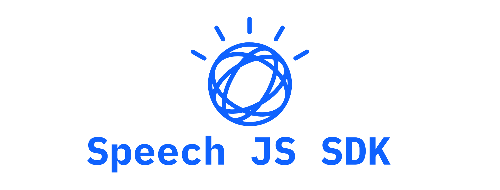

IBM Watson Speech Services for Web Browsers

[](https://travis-ci.org/watson-developer-cloud/speech-javascript-sdk)
[](https://www.npmjs.com/package/watson-speech)

Allows you to easily add voice recognition and synthesis to any web app with minimal code.

### Built for Browsers

This library is primarily intended for use in web browsers. Check out [ibm-watson](https://www.npmjs.com/package/ibm-watson) to use Watson services (speech and others) from Node.js.

However, a **server-side component is required to generate auth tokens**. SDKs are available for [Node.js](https://github.com/watson-developer-cloud/node-sdk#authorization), [Java](https://github.com/watson-developer-cloud/java-sdk), [Python](https://github.com/watson-developer-cloud/python-sdk/blob/master/examples/authorization_v1.py), which can be used with a server-side application.

### Installation - standalone

Pre-compiled bundles are available from on GitHub Releases - just download the file and drop it into your website: https://github.com/watson-developer-cloud/speech-javascript-sdk/releases

### Installation - bower

```sh
bower install --save watson-speech
```

### Installation - npm with Browserify or Webpack

This library can be bundled with [browserify](http://browserify.org/) or [Webpack](http://webpack.github.io/)
and easy included in larger projects:

    npm install --save watson-speech

This method enables a smaller bundle by only including the desired components, for example:

```js
var recognizeMic = require('watson-speech/speech-to-text/recognize-microphone');
```

## Using with IAM

This SDK _CAN_ be used in the browser with services that use IAM for authentication. This does require a server-side component - an endpoint used to retrieve the token.

In a local environment you should set only the `TEXT_TO_SPEECH_IAM_APIKEY` and `SPEECH_TO_TEXT_IAM_APIKEY` in your `.env` file.

Once that is set up, the token can be used in your SDK request with the parameter `access_token`.

## Using with Angular

Make sure `polyfills.ts` has following entries:

```js
(window as any).global = window;
(window as any).process = require('process/browser');
import 'zone.js/dist/zone';  // Included with Angular CLI.
global.Buffer = global.Buffer || require('buffer').Buffer;
```

## Changes

See [CHANGELOG.md](CHANGELOG.md) for a complete list of changes.

## Development

### Global Transaction ID

Unfortunately, there is no way to set or get the global transaction id provided by the initial websocket handshake with the Speech service. This is due to limitations from the W3C Websocket API for browser. It is possible; however, to grab the `X-Global-Transaction-Id` header through a browser's dev tool "Network" tab. After making a call to the service, look for a request to the `v1/recognize` endpoint which should return a 101 code. The response headers from that request will contain the `X-Global-Transaction-Id` header.

### Testing

The test suite is broken up into offline unit tests and integration tests that test against actual service instances.

- `npm test` will run the linter and the offline tests
- `npm run test-offline` will run the offline tests
- `npm run test-integration` will run the integration tests

To run the integration tests, service credentials are required. Make sure you have a valid `.env` file in the root directory.
